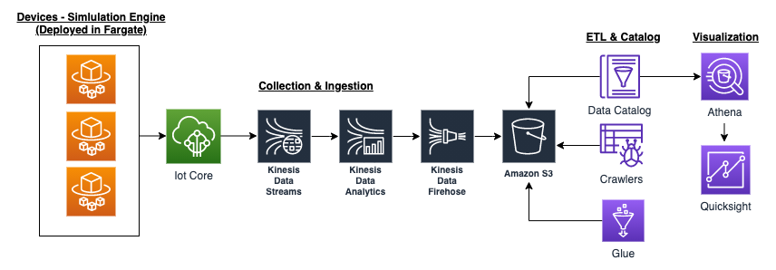

<!--

# Welcome to your CDK TypeScript project!

This is a blank project for TypeScript development with CDK.

The `cdk.json` file tells the CDK Toolkit how to execute your app.

## Useful commands

 * `npm run build`   compile typescript to js
 * `npm run watch`   watch for changes and compile
 * `npm run test`    perform the jest unit tests
 * `cdk deploy`      deploy this stack to your default AWS account/region
 * `cdk diff`        compare deployed stack with current state
 * `cdk synth`       emits the synthesized CloudFormation template

-->

# Pinpoint (Ongoing)

## Inspiration

Data loses its value over time. This is especially true when it comes to the inventory deliveries. Having a condense outlook of what is happening in real time can give fleet managers better visibility of ETA predictions, traffic conditions and even the state of the goods themselves(e.g temperature for food and medication deliveries)

Aside from visibility, they can quickly make reactive and preventive decisions from warnings triggered based on real-time insights gathered. An example would be if a truck is behind schedule due to a tire blowout, another order can dispatch instantly to ensure the goods can be delivered on time.

## Introduction

A serverless device tracker built to ingest, analyze, monitor and visualize delivery data from IOT based sensors placed in trucks in near real-time using Kinesis and other AWS Technologies. Data being tracked includes truck id, location, speed, temperature and humidity.

Repo includes the AWS CDK(Infrastructure as code) written in typescript that will provision the necessary resources in the cloud to boot up the service.

## Architecture

## Technologies

- TypeScript
- AWS Fargate
- AWS Kinesis
- S3 Bucket
- AWS Glue & Crawlers
- AWS Athena
- AWS Quicksight
- AWS Cloud Development
- AWS Cloudformation

## Deep Dive

Todo
